# Activity-Compilers

## Activity 1
scanner_simples.sh
```sh
echo "========================================"
echo "  SCANNER SIMPLES - Fluxo de Entrada"
echo "========================================"
echo ""

numero_linha=0

while IFS= read -r linha; do

    numero_linha=$((numero_linha + 1))

    # Etapa 3: Pre-processamento - remove espacos, tabs e \r
    # Equivalente ao que o scanner faz antes de tokenizar
    linha_limpa=$(echo "$linha" | tr -d ' \t\r')

    echo "[SCANNER] Linha $numero_linha recebida : '$linha_limpa'"

    # Aqui viria o processamento lexico (analise de tokens)
    # Pode ser expandido com AI/LLM futuramente

done

echo "========================================"
echo "  Fim do stream de caracteres."
echo "  Total de linhas lidas: $numero_linha"
echo "========================================"
```


## Activity 2
utilizando regex para analisar a seguinte linha:
`position = initial + rate * 60`
para capturar todos os tokens:
```re
/([a-zA-Z_][a-zA-Z0-9_]*)|(\d+)|([=+\-*])|(\s+)/gm
```


A regex foi usada para identificar identificadores, números e operadores no código. Cada token corresponde a um padrão definido por expressões regulares. Isso demonstra como o scanner de compiladores reconhece lexemas no fluxo de caracteres.


## Activity 3
no Editor do VsCode, não é possível juntar as duas análises léxicas.
removendo comentários de código:
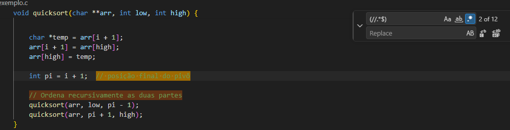
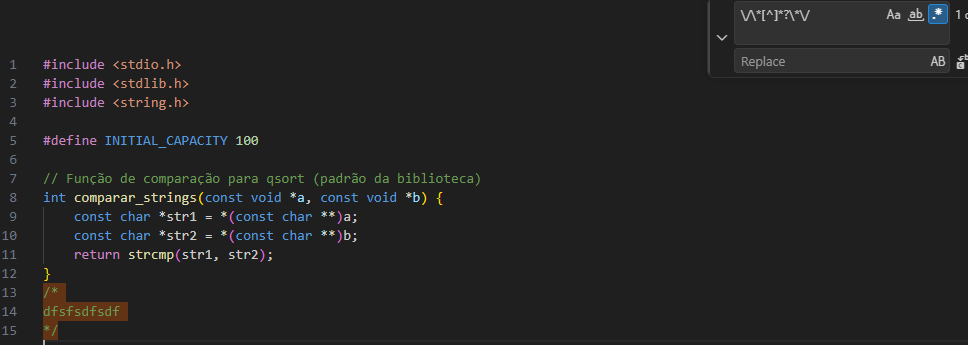
trocando = por := em códigos:
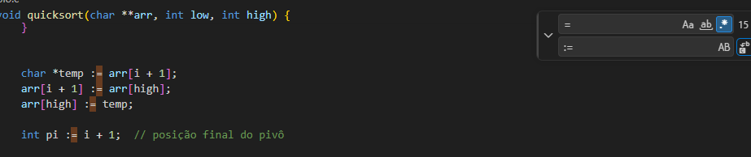

Remover espaços extras
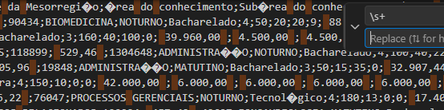

converter CSV para TSV podemos substituir as `,` por `\t`
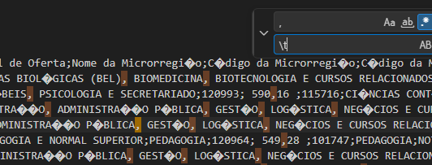

CSV de portugûes para inglês trocando `,` para `.` o mesmo pode ser feito com `,` para `;`
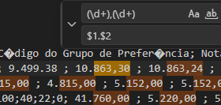

## Activity 4
Função que tokeniza texto e retorna lista de tuplas
Python:
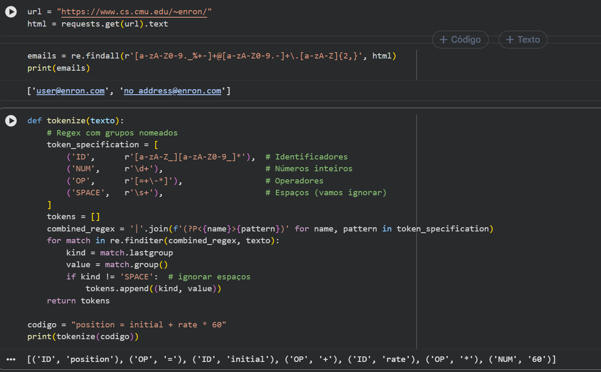

Java:
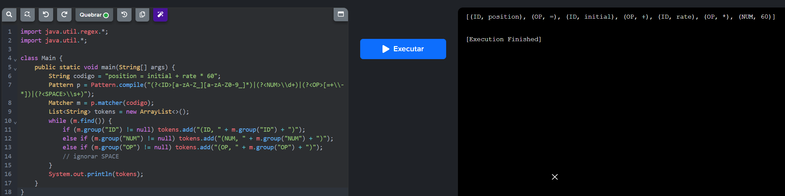

## Activity 5
DFA (Deterministic Finite Automata) para reconhecer números inteiros.
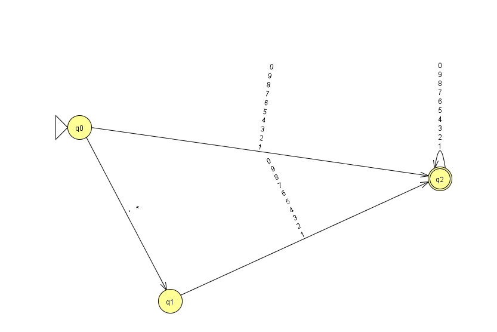

DFA para identificadores.
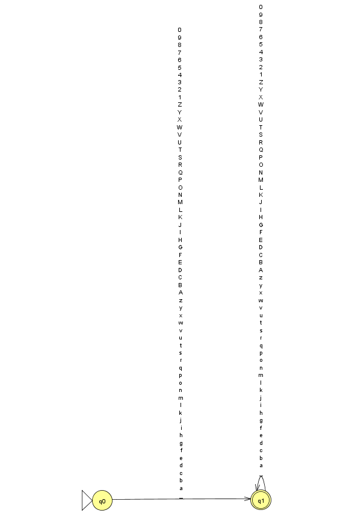

NFA (Non-Deterministic Finite Automata) para operador = e == (ambiguidade).
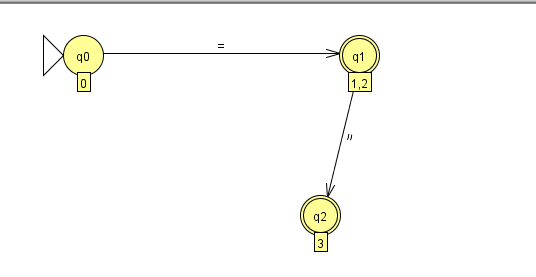

Converter NFA → DFA (ferramenta automática do JFLAP).
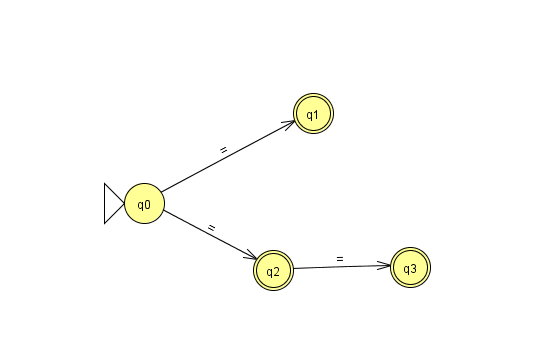
Simular passo a passo com a string do livro.
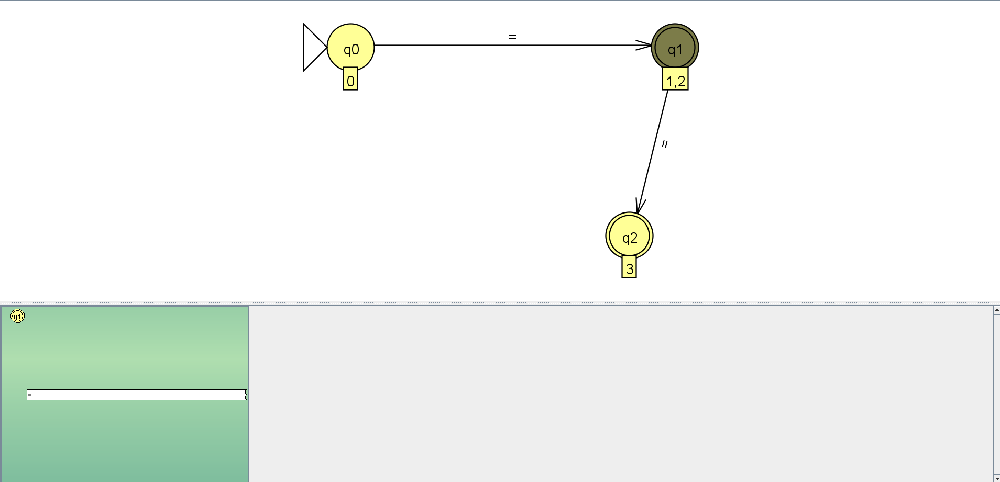
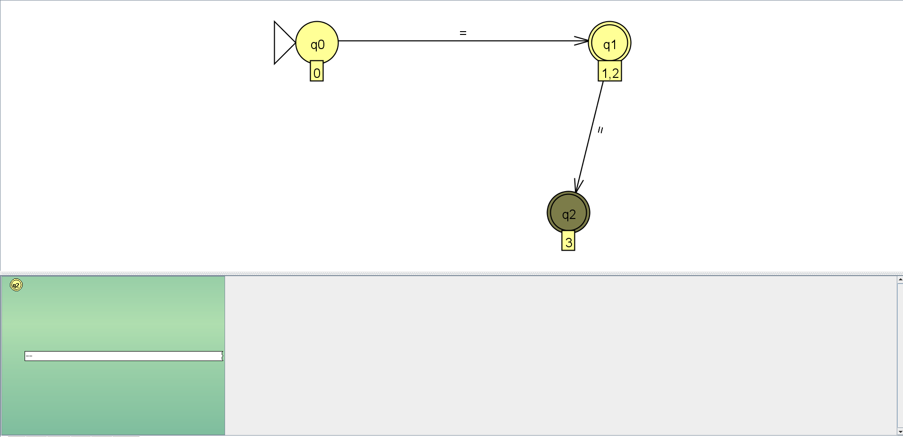
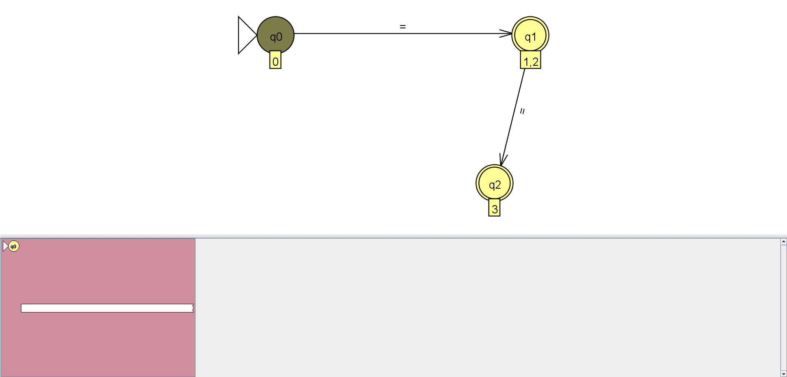
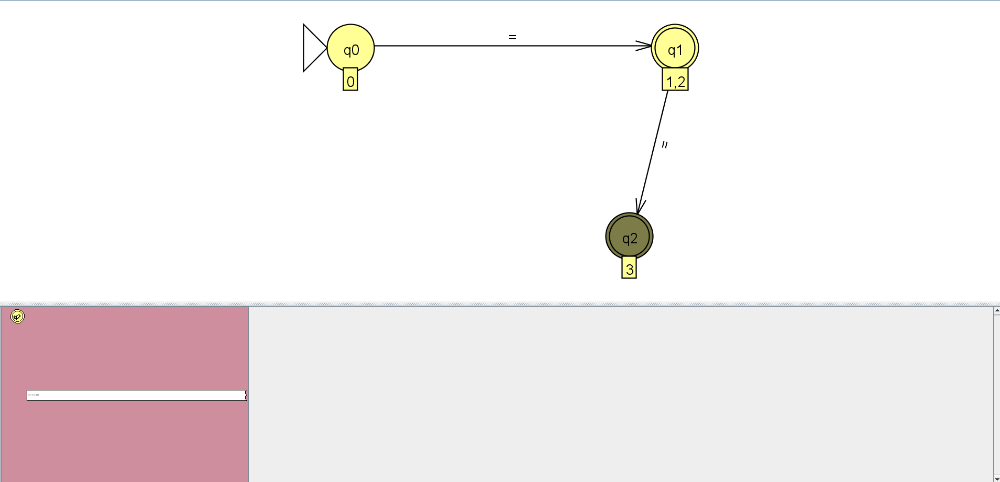